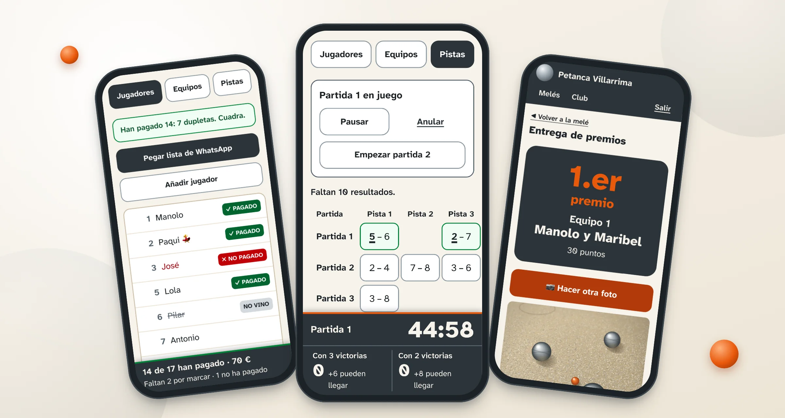
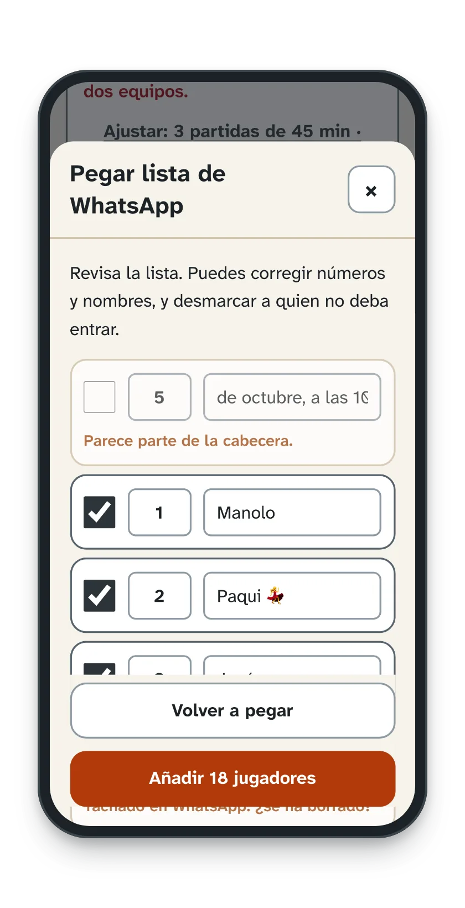
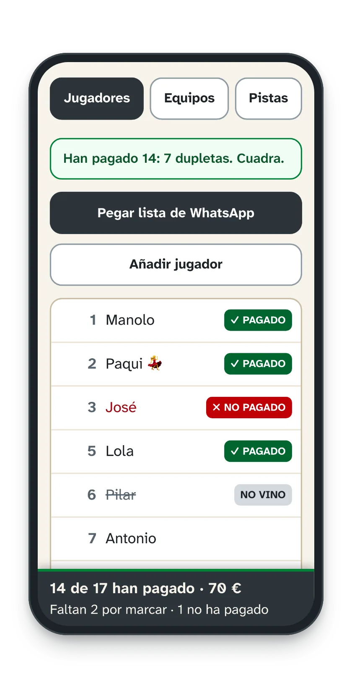
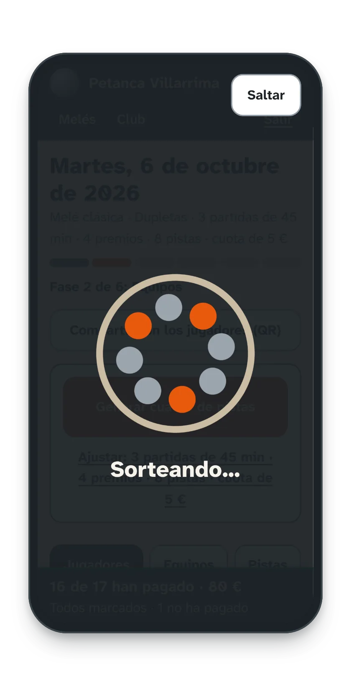
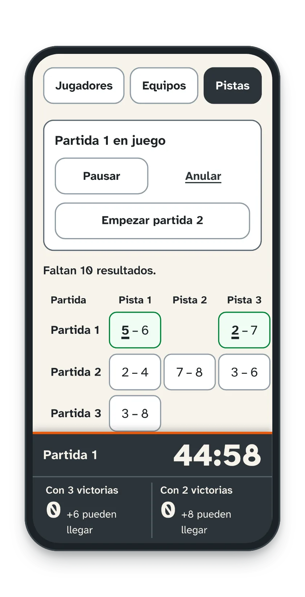
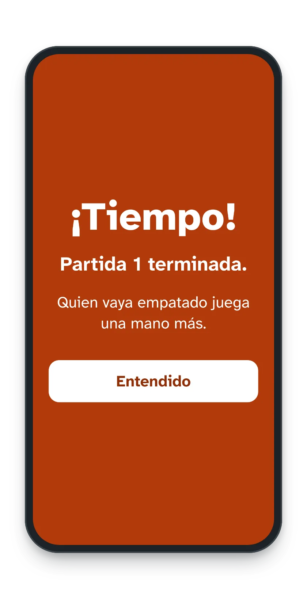
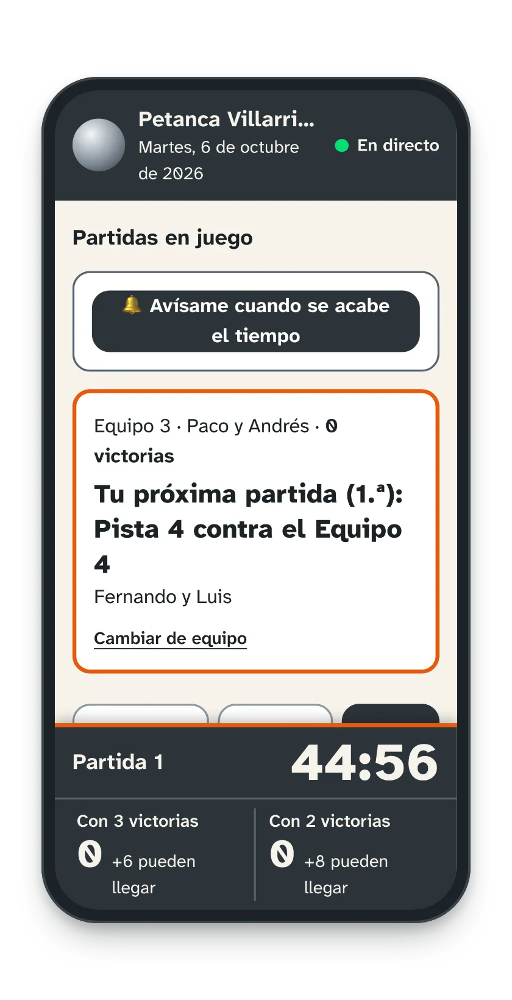
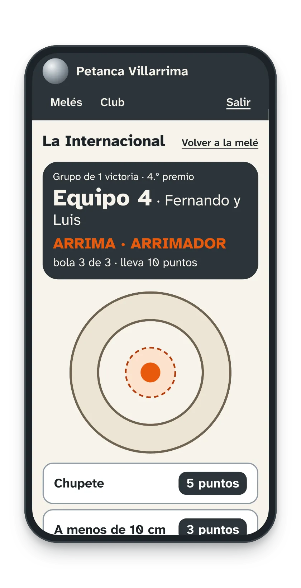
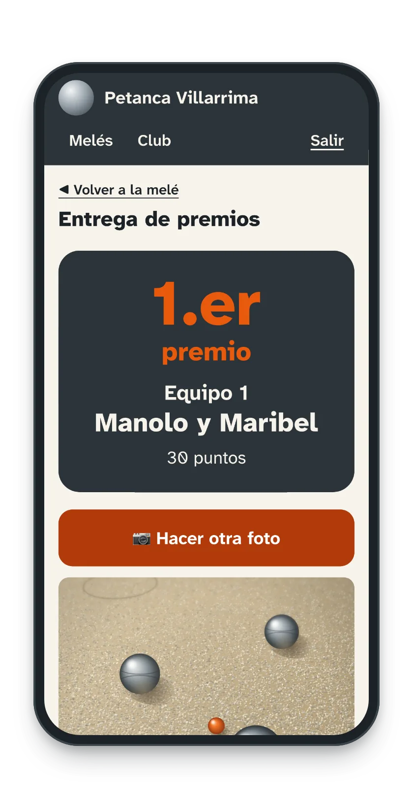
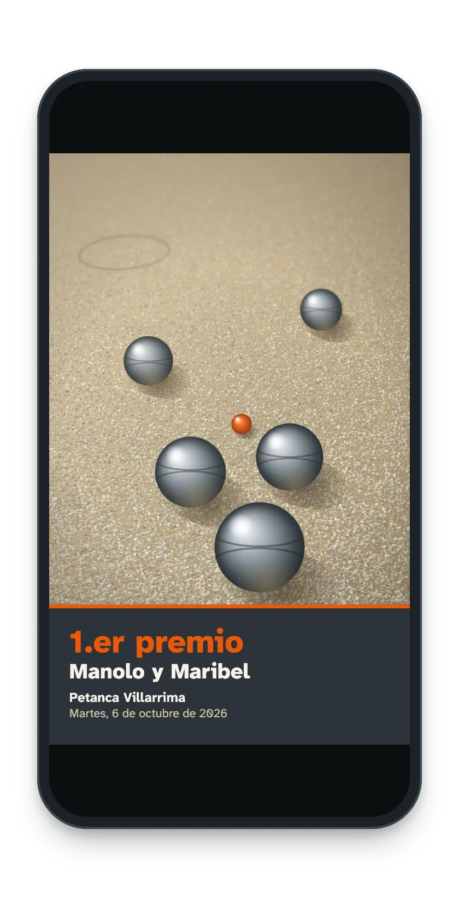

<p align="center">
  
</p>

<h1 align="center">Arrima</h1>

<p align="center">
  <strong>Las melés de petanca de tu club, sin papel.</strong><br>
  Inscripción, cobro, sorteo, pistas, cuenta atrás, la Internacional y premios. Desde el móvil.
</p>

<p align="center">
  <a href="https://arrima-petanca.vercel.app"><strong>Abrir Arrima</strong></a>
  &nbsp;·&nbsp;
  <a href="#cómo-es-una-melé-con-arrima">Cómo funciona</a>
  &nbsp;·&nbsp;
  <a href="#cómo-está-hecho">Cómo está hecho</a>
  &nbsp;·&nbsp;
  <a href="docs/DESARROLLO.md">Desarrollo</a>
</p>

<p align="center">
  <a href="https://github.com/AdrianLuchaco/arrima/actions/workflows/ci.yml"></a>
  
  
  
  
  
  <a href="LICENSE"></a>
</p>

<p align="center">
  
</p>

## ¿Qué es Arrima?

Una **melé** es el torneo de un día de los clubes de petanca: la gente se apunta, los equipos se sortean entre los apuntados y se juegan varias partidas hasta repartir los premios. Normalmente se organiza con una lista de WhatsApp, una libreta y mucha paciencia.

Arrima lo lleva todo desde el móvil de quien organiza, a pie de pista:

- **Hecha para la pista:** letra grande y muy legible al sol, botones grandes y todo a mano con una sola mano.
- **Aguanta la mala cobertura:** se abre al momento aunque no haya señal, y los resultados apuntados sin conexión se envían solos cuando vuelve.
- **Se instala como una app** en Android y en iPhone, sin pasar por ninguna tienda.
- **Los jugadores lo siguen en directo** desde su móvil con un código o un QR, sin crear cuenta.
- **Varios móviles del club a la vez:** lo que apunta uno aparece al momento en los demás.

## Cómo es una melé con Arrima

> Las capturas son de un club de ejemplo, con nombres inventados.

### 1 · Inscripción y cobro

<p align="center">
  
  
  
</p>

- **Pega la lista de WhatsApp** tal como la escribe la gente. Arrima entiende «1.», «2)», «3-», los nombres tachados y las líneas de la cabecera, y te la enseña para revisarla antes de añadirla.
- **Cobra la inscripción** tocando cada nombre: ✓ PAGADO, ✗ NO PAGADO o NO VINO, con lo recaudado siempre a la vista. Con una cuota de 0 € no se cobra nada.
- **Sortea los equipos** en dupletas o tripletas, solo entre quienes han pagado. Si los números no cuadran, te propone cómo arreglarlo: hacer un equipo distinto, dar de baja a alguien o añadir jugadores.

### 2 · Durante las partidas

<p align="center">
  
  
  
</p>

- **Cuadro de pistas** para todas las partidas, evitando que se repitan rivales. Los resultados se apuntan tocando el partido y el equipo que ha ganado, y el contador dice, por ejemplo, cuántos equipos tienen ya 3 victorias y cuántos pueden llegar todavía.
- **Cuenta atrás de cada partida**, la misma en todos los móviles. Al llegar a cero suena, vibra y sale «¡Tiempo!».
- **Los jugadores** abren la melé con el código o el QR y ven su próxima pista y su rival. Pueden pedir que se les avise al acabar el tiempo, aunque tengan el móvil bloqueado (en iPhone, con la app añadida a la pantalla de inicio).

### 3 · La Internacional y los premios

<p align="center">
  
  
  
</p>

- **La Internacional** deshace los empates a victorias bola a bola, arrimando y tirando, con la tabla de puntos de tu club. Si aún hay empate, se juega un desempate.
- **Entrega de premios** del último al primero, con la foto de cada equipo premiado.
- **Al grupo de WhatsApp:** una imagen por premio, con el puesto, los nombres, el club y la fecha, y la clasificación copiada para pegarla debajo.

### Y además

- Los ajustes del club (pistas, partidas, minutos, premios, cuota y tabla de puntos), que se pueden cambiar solo para un día.
- Volver a la fase anterior sin perder nada de lo apuntado.
- El histórico de melés cerradas.
- Recuperar la contraseña por correo.

## Para los clubes

Arrima funciona en **[arrima-petanca.vercel.app](https://arrima-petanca.vercel.app)**. Se abre en el navegador y, si quieres, se instala en el móvil desde el propio aviso de la app.

El alta de clubes es por invitación. Si te interesa para tu club, [rellena este formulario](https://github.com/AdrianLuchaco/arrima/issues/new?template=alta-club.yml) con el nombre del club y la población. Es público, así que no pongas datos personales: el código de invitación nunca se publica, te diremos cómo seguir por privado.

## Cómo está hecho

- **Backend:** Java 25 · Spring Boot 4.1 · Spring Security · JPA · Flyway · PostgreSQL
- **Frontend:** React 19 · TypeScript · Vite · Tailwind CSS · TanStack Query · PWA con *service worker* propio
- **Tiempo real:** Server-Sent Events para el directo y Web Push propio (RFC 8291 y 8292) para el aviso «¡Tiempo!»
- **Pruebas:** Más de 550 tests en el backend (unitarios y de integración con Testcontainers) y tests de Vitest en el frontend
- **Producción:** Vercel (web) · Render (API en Docker) · Supabase (base de datos y fotos) · Brevo (correos), en planes gratuitos

```
 móvil ──► Vercel (frontend) ── /api/* ──► Render (Spring Boot) ──► Supabase (PostgreSQL + fotos)
                                                                ├──► Brevo (correos)
                                                                └──► push de los navegadores (aviso «¡Tiempo!»)
```

**Seguridad.** Cada club solo ve lo suyo: el club sale siempre del token de sesión, nunca de la petición. La sesión es un JWT de 15 minutos más una cookie de renovación rotatoria (`HttpOnly`, `Secure`, `SameSite=Strict`). Hay límites de intentos, enlaces firmados y con caducidad para las fotos de un bucket privado, CSP estricta y ningún secreto en el código: gitleaks revisa cada commit y el CI. Las revisiones completas están en la documentación.

## Documentación

| Documento | Para qué |
|---|---|
| [Desarrollo](docs/DESARROLLO.md) | Estructura del código, cómo arrancarlo en local, tests y variables de entorno |
| [Despliegue](docs/DESPLIEGUE.md) | Ponerlo en producción paso a paso, con servicios gratuitos |
| [Seguridad del código](docs/seguridad-owasp.md) | Revisión según el OWASP Top 10:2025 |
| [Seguridad en producción](docs/revision-seguridad-produccion.md) | Comprobaciones en vivo sobre la app desplegada |
| [Pruebas en móviles](docs/comprobacion-en-moviles.md) | Lista para comprobar en Android e iPhone lo que depende del móvil |
| [Avisar de un fallo de seguridad](SECURITY.md) | Cómo contarlo en privado |

## Licencia

Arrima es software libre con licencia [AGPL-3.0](LICENSE). Puedes usarlo, estudiarlo, modificarlo e instalarlo en tu propio servidor. Si ofreces a otros una versión modificada a través de internet, tienes que publicar su código con la misma licencia.

© 2026 Adrian ([@AdrianLuchaco](https://github.com/AdrianLuchaco))
